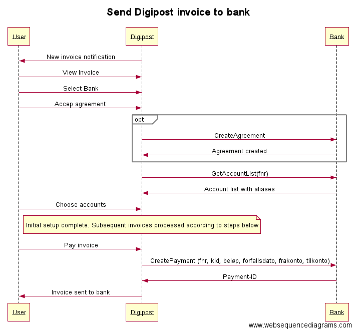

# Requirements for bank payment API

This document describes the general requirements for the API that a bank provides to Digipost to allow customers/users to pay invoices directly from Digipost.

When the customer receives an invoice in Digipost they will be prompted the option to set up 'one click payment' to their bank. They will then go through the following steps:

1. Accept the terms of the service and allow Digipost to retrieve their account list and create payments on their behalf. Digipost will optionally invoke the API-function [CreateAgreement](#createagreement)
2. Select one or more accounts that will be used to pay invoices from. Digipost will invoke the API-function [GetAccountList](#getaccountlist)
3. Pay invoices directly from Digipost from one of the accounts selected above. Digipost will invoke the API-function [CreatePayment](#createpayment)



## Table of contents

* [CreateAgreement](#createagreement)
* [GetAccountList](#getaccountlist)
* [CreatePayment](#createpayment)
* [Security](#security)

## CreateAgreement

If required by the bank, Digipost will send a CreateAgreement request to signal that the user has accepted (in Digipost) the general terms for the service and agrees that Digipost can retrieve account numbers and create payments on behalf of the user. The request may contain an agreement digitally signed (BankId) by the user.

The bank stores the agreement and uses it to authorize subsequent payments for the same customer.

### Request (parameters)

|Field name     |Type  |Length|Description|
|---------------|------|------|-----------|
|bank-identifier|string|      |Used to identify the bank when multiple banks use the same payment platform|
|user-id        |string|11    |Fødselsnummer|
|signed-agreement ||      |Optional agreement text with digital signature|

### Example request
```xml
POST /api/agreements

<agreement>
  <bank-identifier>1234</bank-identifier>
  <user-id>10037819032</user-id>
  <signed-agreement>...</signed-agreement>
</agreement>
```

### Example response
```
HTTP/1.1 204 No Content
```

## GetAccountList

Digipost retrieves the account list and presents it to the user which chooses which accounts they will pay invoices from. The chosen accounts are stored on the user's profile in Digipost. Only accounts that can be used for payment should be returned.

### Request (parameters)

|Field name     |Type  |Length|Description|
|---------------|------|------|-----------|
|bank-identifier|string|      |Used to identify the bank when multiple banks use the same payment platform|
|user-id        |string|11    |Fødselsnummer|

### Response

|Field name     |Type   |Length|Description|
|---------------|-------|------|-----------|
|accounts       |list:account   |      |List of account elements|
|account        |account|      |Element containing the fields below           |
|account-number |string |11    |Account number|
|alias          |string |      |Account alias chosen by the user|

### Example request
```
GET /api/accounts?user-id=10037819032&bank-identifier=1234
```

### Example response
```xml
HTTP/1.1 200 OK

<accounts>
  <account>
    <account-number>03786233254</account-number>
    <alias>Lønnskonto</alias>
  </account>
  <account>
    <account-number>03786233255</account-number>
    <alias>Regninger</alias>
  </account>
</accounts>
```

## CreatePayment

When the user receives an invoice they can choose which account to pay from and then submit the payment with one click.

After successful response it is expected that the invoice has been added to pending payments in the bank and that it will automatically be paid on the due date unless manually stopped by the user (or due to insufficient funds).

### Request (parameters)

|Field name     |Type   |Length|Description|
|---------------|-------|------|-----------|
|bank-identifier|string |      |Used to identify the bank when multiple banks use the same payment platform|
|user-id        |string |11    |Fødselsnummer|
|from-account-number|string|11 |The account to pay from|
|to-account-number|string|11   |The receiver's account number|
|kid            |string |25    |Customer identification (kundeidentifikasjon)|
|amount         |decimal|10    |Payment amount|
|due-date       |date   |10    |Invoice due date|
|issuer-name    |string |80    |(optional) The name of the invoice issuer|
|invoice-id     |string |20    |(optional) Invoice ID that can be used to retrieve the invoice specification in pdf/html from Digipost|

### Response

|Field name     |Type   |Length|Description|
|---------------|-------|------|-----------|
|payment-id     |string |      |Payment identifier to be able to trace back to the payment if neccessary|

### Example request
```xml
POST /api/payments

<payment>
  <bank-identifier>1234</bank-identifier>
  <user-id>10037819032</user-id>
  <from-account-number>14300642641</from-account-number>
  <to-account-number>20951981088</to-account-number>
  <kid>120002315493</kid>
  <amount>245.65</amount>
  <due-date>2016-10-23</due-date>
  <issuer-name>Hafslund</issuer-name>
  <invoice-id>876867</invoice-id>
</payment>
```

### Example response
```xml
HTTP/1.1 200 Ok

<payment-id>879823475</payment-id>
```

## API type

HTTP based with XML or JSON message format.

## Security

* Encrypted transport (TLS for HTTPS)
* Session based or per message authentication
  - Each message can be digitally signed for stateless authentication
  - Digitally signed authentication with subsequent session identitier is also possible
* Identification using X509 certificates
