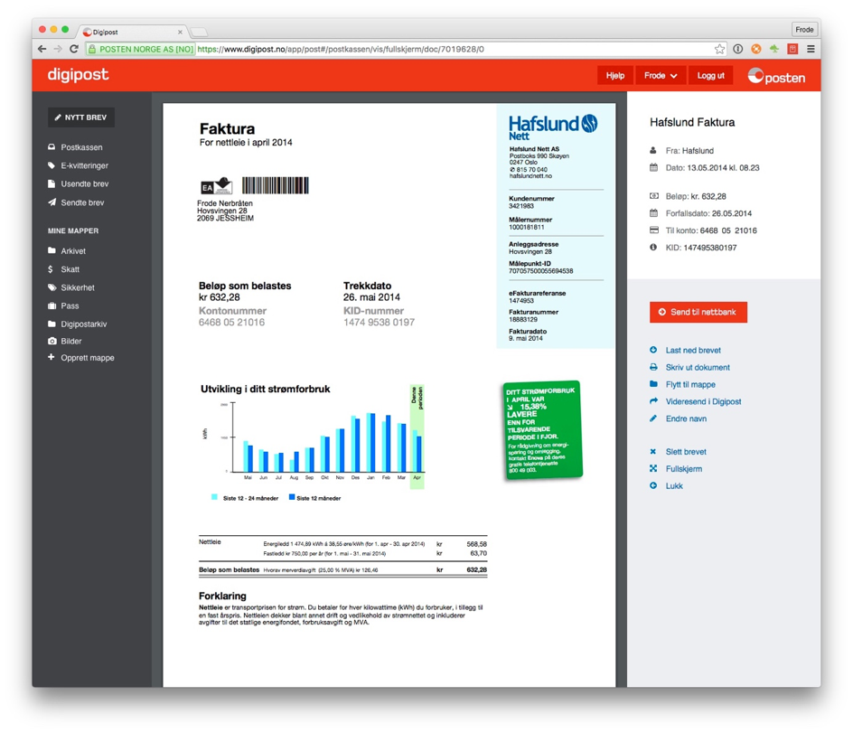
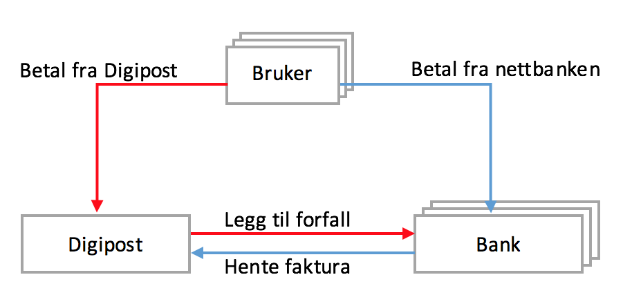
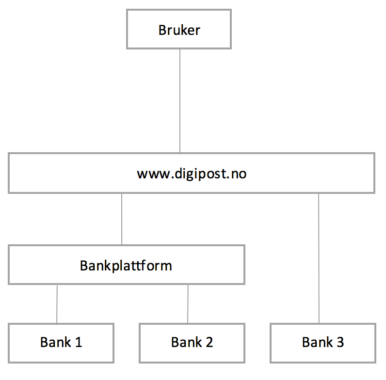
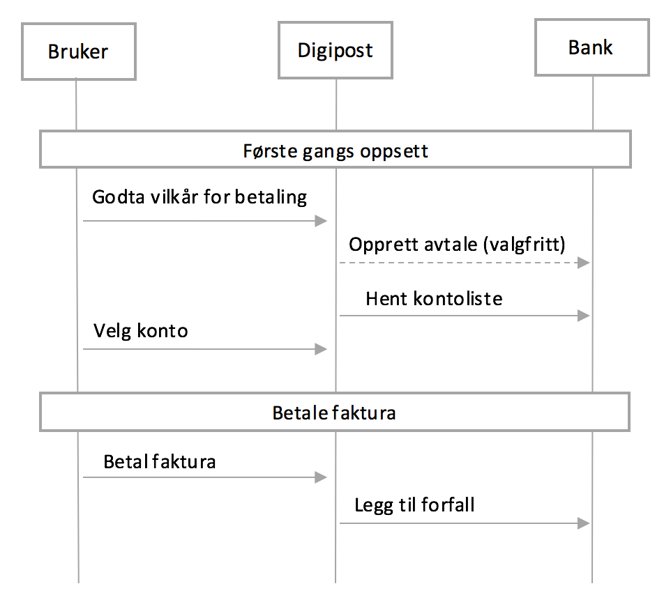
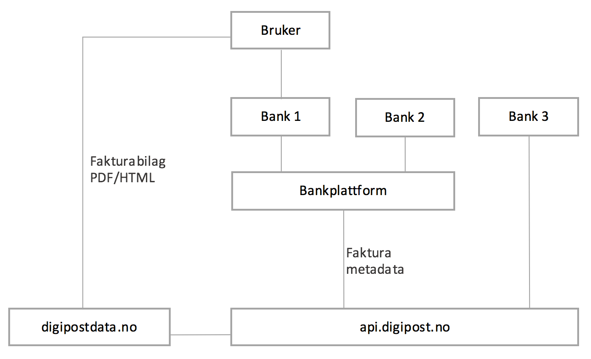
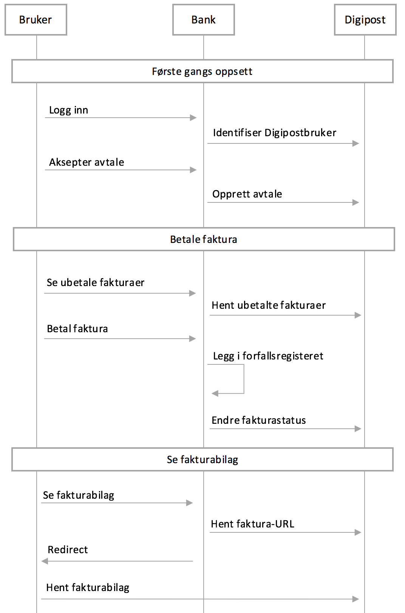

# Tjenestebeskrivelse: Faktura i Digipost

## Innhold

* [Innledning](#innledning)
* [Parter og roller](#parter-og-roller)
* [Overordnet tjenestebeskrivelse](#overordnet-tjenestebeskrivelse)
* [Betal fra Digipost](#betal-fra-digipost-1)
    * [Avtaleinngåelse](#avtaleinngåelse)
    * [Valg av kontonummer](#valg-av-kontonummer)
    * [Legg faktura til forfall](#legg-faktura-til-forfall)
* [Betal fra nettbanken](#betal-fra-nettbanken-1)
    * [Identifisering av Digipostbrukere](#identifisering-av-digipostbrukere)
    * [Opprette avtale om utlevering av fakturainformasjon](#opprette-avtale-om-utlevering-av-fakturainformasjon)
    * [Hente fakturametadata og bilag](#hente-fakturametadata-og-bilag)
    * [Oppdatere fakturastatus](#oppdatere-fakturastatus)
    * [Teknisk løsning for APIet](#teknisk-løsning-for-apiet)
    * [Sikkerhet](#sikkerhet)
    * [Klientbibliotek](#klientbibliotek)

## Innledning

Dette dokumentet beskriver tjenestene Digipost tilbyr til banker for å integrere betaling av fakturaer mottatt i Digipost direkte i banken.
Fakturaer kan betales på to måter og banken bør tilby begge samtidig for å gjøre betaling enklest og mest fleksibelt for brukeren:

1. Betale direkte fra postkassen i Digipost
2. Betale fra nettbanken på samme måte som e-faktura

##	Parter og roller

### Digipost

Digipost er Posten Norge AS sin digitale postkasse. Digipost mottar og oppbevarer fakturaer på vegne av sine brukere. Digipost tilbyr APIer som banken kan benytte til å tilby betaling av Digipost-fakturaer i sin løsning.

### Banken

Banken tilbyr banktjenester til kunder som også kan være brukere i Digipost. Banken er klienten som ønsker å integrere funksjonalitet fra Digipost i sine løsninger. Banken kan enten integrere direkte med Digipost eller benytte en plattform levert av en underleverandør (se Figur 1). Tjenestene tilbys til banken uavhengig av om underleverandør benyttes. Nettbanken er en løsning som banken tilbyr sine kunder der de bl.a. kan betale fakturaer.

### Brukeren / Kunden

Brukeren er kunde hos og har konto i Digipost og/eller Banken. Der det er relevant skilles det mellom Digipost-bruker og bankbruker. Det er brukeren som eier fakturaene som oppbevares i Digipost. Brukeren ønsker å kunne betale fakturaer mottatt i Digipost på en enkel måte.

## Overordnet tjenestebeskrivelse

Fakturaer som sendes i Digipost inneholder metadatafelter for betaling: KID, kredittkonto, beløp og forfallsdato i tillegg til det originale fakturabilaget fra avsender. Det er også etter avtale mulig å sende fakturaer uten KID som for eksempel kredittkortfaktura der kredittkonto er unik for kunden.

Når en bruker mottar en faktura i Digipost kan hun alltid se både fakturabilag og metadata når hun logger på Digipost. Figur 1 viser hvordan fakturaen vises i Digipost.

For å gjøre det enklest mulig for brukeren å betale fakturaen tilbyr Digipost to måter å betale fakturaen på. Figur 2 illustrere de to alternativene.

Figur 1: Fakturavisning i Digipost

###	Betal fra Digipost

Brukeren kan sende fakturaen direkte til forfallsregisteret i sin bank ved å trykke på knappen ”Send til nettbank” i høyremenyen i skjermbildet på Figur 1.

Løsningen baserer seg på at Digipost har en integrasjon med APIer som banken tilbyr. APIene må støtte å hente ut kontonummer og opprette betalinger. Se *[Betal fra Digipost](#betal-fra-digipost-1)* for detaljert løsningsbeskrivelse.

###	Betal fra nettbanken

Brukeren kan betale fakturaen direkte fra nettbanken sin. Når brukeren logger på nettbanken hentes fakturainformasjonen fra Digipost og presenteres i nettbanken med mulighet til å legge den i forfallsregisteret på samme måte som for e-faktura.

Løsningen baserer seg på at Banken har en integrasjon med APIer som Digipost tilbyr. APIene støtter uthenting av fakturainformasjon og oppdatering av fakturastatus etter betaling. Se *[Betal fra nettbanken](#betal-fra-nettbanken-1)* for detaljert løsningsbeskrivelse.

Figur 2: Integrasjonsalternativer

##	Betal fra Digipost

Denne seksjonen beskriver løsningen hvor brukeren kan sende fakturaen direkte til forfallsregisteret i sin bank fra Digipost. Løsningen baserer seg på at Digipost har en integrasjon med APIer som banken tilbyr (se Figur 3).

Figur 3: Systemskisse for betal fra Digipost

Betal fra Digipost vil for brukeren innebære følgende steg i Digiposts brukergrensesnitt (se Figur 4):

1.	Første gangs oppsett med aksept av avtale og valg av betalingskonto
2.	Ett klikks legg faktura til forfall på kontoen som ble valgt i steg 1

Figur 4: Brukerflyt betal fra Digipost

###	Avtaleinngåelse

Før kontonummer kan hentes ut må brukeren akseptere vilkårene til tjenesten og godta at banken utleverer kontoinformasjon til Digipost. Dette skjer i grensesnittet i Digipost. Samtykket lagres i Digipost. I de tilfeller der banken også ønsker å lagre samtykket, vil Digipost gjøre et API-kall mot banken for å opprette en avtale på vegne av brukeren identifisert med fødselsnummer.

###	Valg av kontonummer

Før en faktura kan legges til forfall må brukeren velge hvilken konto i banken fakturaen skal betales fra. Dette gjøres før første betaling eller når brukeren ønsker å bytte kontonummer. Digipost gjør et API-kall mot banken for å hente kontoliste for brukeren identifisert med fødselsnummer. Brukeren velger betalingskonto og denne lagres på brukerens profil i Digipost.

###	Legg faktura til forfall

Når brukeren har valgt betalingskonto vil hun kunne legge en faktura til forfall ved å trykke på knappen ”Send til nettbank” i visningsbildet for fakturaen i Digipost (se Figur 1). Digipost gjør et API-kall mot banken for å opprette en betaling på vegne av brukeren identifisert med fødselsnummer. Følgende metadata sendes med: KID, kreditkontonummer, beløp, forfallsdato og tidligere valgt betalingskontonummer.

##	Betal fra nettbanken

Denne seksjonene beskriver løsningen hvor brukeren kan betale fakturaen direkte fra nettbanken sin. Når brukeren logger på nettbanken hentes fakturainformasjonen fra Digipost og presenteres i nettbanken med mulighet til å legge den i forfallsregisteret.

Løsningen baserer seg på at Banken har en integrasjon med APIer som Digipost tilbyr (se Figur 4).

Figur 5: Systemskisse for betal fra nettbanken

Betal fra nettbanken vil for brukeren innebære følgende steg i nettbankens brukergrensesnitt (Se Figur 6):

1.	Første gangs oppsett med aksept av avtale om utlevering av fakturainformasjon
2.	Se oversikt over ubetalte fakturaer
3.	Betale faktura

Figur 6: Brukerflyt betal fra nettbanken

###	Identifisering av Digipostbrukere

Banken kan spørre om en bankkunde, identifisert med fødselsnummer, er bruker i Digipost for å kunne avgjøre om hun skal få tilbud om å vise fakturaer fra Digipost i nettbanken.

Følgende API-operasjoner er tilgjengelig:

#### IdentifyUser

Identifiserer en bruker basert på fødselsnummer og indikerer om brukeren har Digipostkonto eller ikke.

###	Opprette avtale om utlevering av fakturainformasjon

Banken kan hente inn brukerens samtykke som gir banken tilgang til fakturainformasjon i brukerens postkasse i Digipost. Samtykket kan innhentes i bankens brukergrensesnitt og en avtale om utlevering av data opprettes deretter i Digipost for den aktuelle brukeren. Digipost tilbyr APIer for å opprette, oppdatere, lese og slette avtaler. Digipost-brukere har full oversikt over alle sine avtaler når de er logget inn i Digipost og vil kunne slette avtaler de ikke lenger ønsker.

Følgende API-operasjoner er tilgjengelig:

#### CreateAgreement

Brukes til å opprette en avtale mellom brukeren og Digipost om utlevering av informasjon til banken. Brukeren må ha gitt eksplisitt samtykke til dette. Input til kallet vil være fødselsnummer, avtaletype og eventuelle tilleggsattributter som f.eks. om kunden har takket ja til SMS-varsling fra banken.

#### UpdateAgreement

Brukes til å oppdatere en eksisterende avtale.
GetAgreements
Brukes til å hente ut alle avtaler (relatert til banken) for en gitt bruker. Dette kallet kan brukes til å sjekke om det allerede eksisterer en avtale for en bruker.

#### GetAgreement

Brukes til å hente en spesifikk avtale basert på avtalens unike ID.

#### DeleteAgrement

Brukes til å slette en spesifikk avtale basert på avtalens unike ID. Dette gjøres hvis en bruker ønsker å si opp avtalen fra nettbanken.

###	Hente fakturametadata og bilag

Når en avtale er etablert kan banken hente fakturainformasjon for brukeren til behandling i nettbanken. Digipost tilbyr APIer for å hente fakturametadata som KID, kontonummer, beløp og forfallsdato, og fakturabilag (html/pdf). Det er mulig å filtrere resultatet basert på f.eks. fakturastatus (ubetalt, betalt, etc..).

Følgende API-operasjoner er tilgjengelig:

#### GetDocuments

Henter alle fakturaer (som er en type dokument i Digipost) for en bruker. Listen kan filtreres på fakturastatus og et datoparameter styrer hvor langt tilbake i tid fakturaer skal hentes.

#### GetDocument

Henter én spesifikk faktura (dokument) gitt fakturaens unike ID. En faktura har en stabil ID som ikke endrer seg over tid. Denne ID-en kan lagres i banken som referanse til fakturaen etter at den er betalt.

#### GetDocumentCount

Som GetDocuments ovenfor, men gir kun antall fakturaer som spørringen resulterte i. Brukes i hovedsak til å vise antall ubehandlede fakturaer for en bruker. Samme parametere som GetDocuments.

#### GetDocumentContent

Brukes til å hente ut en tidsbegrenset unik URL til fakturabilaget (PDF/HTML) gitt fakturaens unike ID. Brukeren redirectes til URL-en som gir henne direkte tilgang til fakturabilaget.

###	Oppdatere fakturastatus

I det en faktura blir behandlet (lagt i forfallsregisterert) i nettbanken må banken oppdatere status på fakturaen i Digipost. Dette er avgjørende for å unngå dobbelbetalinger. Digipost tilbyr et API for å endre status på en faktura. Dette brukes også hvis en bruker ikke ønsker å behandle fakturaen.

Følgende API-operasjoner er tilgjengelig:

#### UpdateInvoice

Brukes til å oppdatere status på en faktura gitt fakturaens unike ID (gis i responsen fra GetDocuments ovenfor). Gyldige statuser inkluderer: ubetalt, betalt og usynlig

###	Teknisk løsning for APIet

API-funksjonene beskrevet i avsnitt 4 Funksjonalitet tilbys som et sett av REST-tjenester over HTTP. Dataformat er XML eller JSON.

###	Sikkerhet

APIene er kun tilgjengelig over HTTPS og det vil kun være mulig å bruke sikre versjoner av TLS-protokollen.

Hver melding er digitalt signert med klientens private nøkkel og verifiseres av serveren ved hjelp av klientens offentlige sertifikat. Alle responser er signert med serverens private nøkkel og skal verifiseres av klienten ved hjelp av serverens offentlige sertifikat. Signaturen omfatter hele meldingen.

Autentisering gjøres for hver melding når signaturen verifiseres. En klient har kun tilgang til data som omfattes av en avtale knyttet til en spesifikk bruker og banken. En avtale kan når som helst trekkes tilbake enten fra banken eller fra Digipost.

Det må opprettes en virksomhetskonto i Digipost for å få tilgang til APIene og det må lastes opp et virksomhetssertifikat (X509) som vil bli brukt til å verifisere digitale signaturer.

###	Klientbibliotek

For å forenkle integrasjonen tilbyr Digipost et klientbibliotek for Java. Klientbiblioteket utvikles av Digipost og er åpen kildekode. Det gir følgende fordeler:

*	Høynivå Java API som er enkelt å bruke
*	Korrekt implementasjon av sikkerhetsmekanismer
*	Enkel oppgradering til nyeste versjoner (tilgjengelig i maven central)
* Kontinuerlig vedlikeholdt og testet
